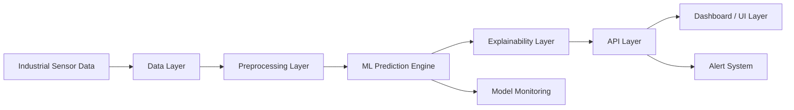
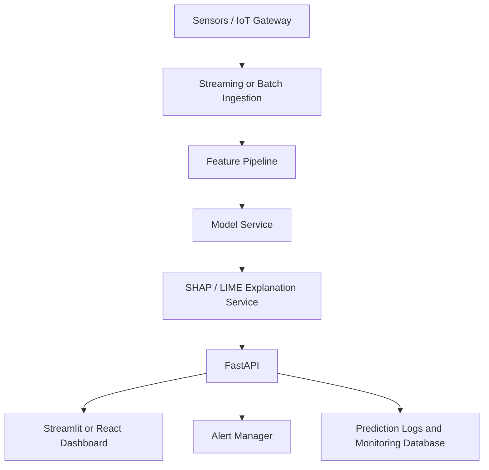

# System Architecture

## Layered Architecture

## Data Layer

The data layer stores raw sensor records, processed datasets, and metadata. In production, this layer can connect to IoT gateways, historians, PLC systems, message queues, or cloud object storage.

## Preprocessing Layer

This layer validates columns, handles missing values, encodes machine type, scales numerical features, and creates engineered features. The same preprocessing pipeline is used during training and inference to prevent training-serving skew.

## ML Prediction Engine

The prediction engine trains and compares multiple models. The best model is selected using F1 score and ROC-AUC because maintenance datasets are often imbalanced. The trained pipeline is serialized as a single artifact so preprocessing and prediction remain consistent.

## Explainability Layer

SHAP provides global and local feature attribution. LIME provides local explanations that are easy to translate into maintenance language. Human-readable explanation templates convert model evidence into actionable engineering statements.

## API Layer

FastAPI exposes health, single-prediction, and batch-prediction endpoints. This enables integration with dashboards, plant systems, and alerting services.

## Dashboard Layer

The Streamlit dashboard supports CSV upload, simulated sensor data, failure-risk scoring, KPI monitoring, local explanation, and sensor trend visualization.

## Alert System

An alert service can be added to send email, SMS, Slack, Microsoft Teams, or maintenance-ticket notifications when predicted risk crosses a threshold.

## Deployment View

## MLOps Extension

For an industry deployment, add data validation, experiment tracking, model registry, drift monitoring, automated retraining, and CI/CD. Monitoring should track input drift, prediction drift, latency, explanation stability, and maintenance outcome feedback.

